# 📋 TaskFlow - Modern Task Management

<div align="center">


**Full-Stack Task Management Application with Modern UI/UX**

🚀 [Live Demo](#) • 📚 [Documentation](#setup) • 🐛 [Report Issues](#)

</div>

---

## ✨ **Features**

- 🔐 **User Authentication** - Secure JWT-based login system
- 📁 **Category Management** - Organize tasks with custom categories
- 📋 **Task Organization** - Create, edit, delete, and manage tasks
- 🌙 **Dark/Light Mode** - Toggle between themes for better UX
- 🎯 **Drag & Drop Interface** - Intuitive task reordering with DND Kit
- 📱 **Responsive Design** - Works seamlessly on all devices
- ⚡ **Real-time Updates** - Instant UI updates with smooth animations

## 🎯 **Tech Stack**

### **Frontend Technologies**


### **Backend Technologies**


### **Database**


### **Development Tools**


## 🏗️ **Architecture Overview**



```mermaid
graph TB
    subgraph "Frontend Layer"
        React[React App]
        UI[Tailwind CSS]
        Motion[Framer Motion]
        DND[DND Kit]
    end
    
    subgraph "Communication"
        Axios[Axios HTTP Client]
    end
    
    subgraph "Backend Layer"
        Express[Express.js Server]
        JWT[JWT Authentication]
        API[REST API]
    end
    
    subgraph "Database Layer"
        MongoDB[MongoDB Database]
    end
    
    React --> Axios
    Axios --> Express
    Express --> JWT
    Express --> MongoDB
    
    style React fill:#61DAFB
    style Express fill:#000000
    style MongoDB fill:#47A248
    style Axios fill:#671ddf
```

## 📋 **Detailed Technology Stack**

| Category | Technology | Purpose | Features |
|----------|------------|---------|----------|
| **Frontend Framework** | React | UI Development | Component-based architecture, Virtual DOM |
| **Styling** | Tailwind CSS | Responsive Design | Utility-first CSS framework |
| **HTTP Client** | Axios | API Communication | Promise-based HTTP requests |
| **Animation** | Framer Motion | UI Animations | Smooth transitions and micro-interactions |
| **Drag & Drop** | DND Kit | Interactive UI | Modern drag and drop functionality |
| **Backend Runtime** | Node.js | Server Environment | JavaScript runtime for server-side |
| **Web Framework** | Express.js | API Development | Minimal and flexible web framework |
| **Database** | MongoDB | Data Storage | Document-based NoSQL database |
| **Authentication** | JWT | Security | JSON Web Tokens for secure auth |

## 🚀 **Quick Start**

### **Prerequisites**
- Node.js (v14 or higher)
- MongoDB (local or cloud instance)
- Git

### **1. Clone Repository**
```bash
git clone https://github.com/YOUR_USERNAME/taskflow.git
cd taskflow
```

### **2. Install Dependencies**
```bash
# Install server dependencies
cd server
npm install

# Install client dependencies
cd ../client
npm install
```

### **3. Environment Configuration**
Create a `.env` file in the server directory:
```env
PORT=8080
MONGODB_URI=mongodb://localhost:27017/taskflow
JWT_SECRET=your_super_secret_jwt_key_here
JWT_EXPIRE=7d
NODE_ENV=development
```

### **4. Start Development Servers**
```bash
# Terminal 1: Start backend server
cd server
npm run dev

# Terminal 2: Start frontend client
cd client
npm run dev
```

### **5. Access Application**
- **Frontend**: http://localhost:3000
- **Backend API**: http://localhost:8080
- **MongoDB**: Default connection on port 27017

## 📁 **Project Structure**

```
taskflow/
├── client/                 # React frontend
│   ├── src/
│   │   ├── components/     # React components
│   │   ├── pages/         # Page components
│   │   ├── hooks/         # Custom React hooks
│   │   ├── utils/         # Utility functions
│   │   └── styles/        # CSS and Tailwind configs
│   ├── public/            # Static assets
│   └── package.json       # Frontend dependencies
├── server/                # Node.js backend
│   ├── controllers/       # Route controllers
│   ├── models/           # MongoDB models
│   ├── middleware/       # Express middleware
│   ├── routes/           # API routes
│   ├── utils/            # Server utilities
│   └── package.json      # Backend dependencies
└── README.md             # Project documentation
```

## 🔧 **Available Scripts**

### **Frontend (client/)**
```bash
npm run dev          # Start development server
npm run build        # Build for production
npm run preview      # Preview production build
npm run lint         # Run ESLint
```

### **Backend (server/)**
```bash
npm run dev          # Start with nodemon
npm start            # Start production server
npm run test         # Run test suite
```

## 🌟 **Key Features Showcase**

### **🔐 Authentication System**
- Secure user registration and login
- JWT token-based authentication
- Protected routes and middleware
- Password encryption with bcrypt

### **📋 Task Management**
- Create, read, update, delete tasks
- Task categorization and filtering
- Due date management
- Priority levels (High, Medium, Low)

### **🎨 Modern UI/UX**
- Clean and intuitive interface
- Smooth animations with Framer Motion
- Drag and drop task reordering
- Dark/Light theme toggle
- Fully responsive design

### **⚡ Performance Features**
- Optimized React components
- Efficient state management
- Fast API responses
- Lazy loading implementation

## 🔗 **API Endpoints**

### **Authentication**
```http
POST /api/auth/register     # User registration
POST /api/auth/login        # User login
GET  /api/auth/profile      # Get user profile
```

### **Tasks**
```http
GET    /api/tasks          # Get all tasks
POST   /api/tasks          # Create new task
PUT    /api/tasks/:id      # Update task
DELETE /api/tasks/:id      # Delete task
```

### **Categories**
```http
GET    /api/categories     # Get all categories
POST   /api/categories     # Create category
PUT    /api/categories/:id # Update category
DELETE /api/categories/:id # Delete category
```

## 🚀 **Deployment**

### **Frontend Deployment (Vercel/Netlify)**
```bash
npm run build
# Deploy dist/ folder to your hosting platform
```

### **Backend Deployment (Heroku/Railway)**
```bash
# Set environment variables
# Deploy server/ directory
```

### **Database (MongoDB Atlas)**
- Create MongoDB Atlas cluster
- Update MONGODB_URI in environment variables
- Configure network access and database user

## 🤝 **Contributing**

1. Fork the repository
2. Create your feature branch (`git checkout -b feature/amazing-feature`)
3. Commit your changes (`git commit -m 'Add amazing feature'`)
4. Push to the branch (`git push origin feature/amazing-feature`)
5. Open a Pull Request

## 📝 **License**

This project is licensed under the MIT License - see the [LICENSE](LICENSE) file for details.

## 📞 **Support**

- 📧 **Email**: support@taskflow.com
- 🐛 **Issues**: [GitHub Issues](https://github.com/YOUR_USERNAME/taskflow/issues)
- 💬 **Discussions**: [GitHub Discussions](https://github.com/YOUR_USERNAME/taskflow/discussions)

---

<div align="center">

**Built with ❤️ using React & Node.js**

⭐ **Star this repository if you find it helpful!**

[🚀 Live Demo](#) • [📚 Documentation](#) • [🔧 API Docs](#)

</div>
