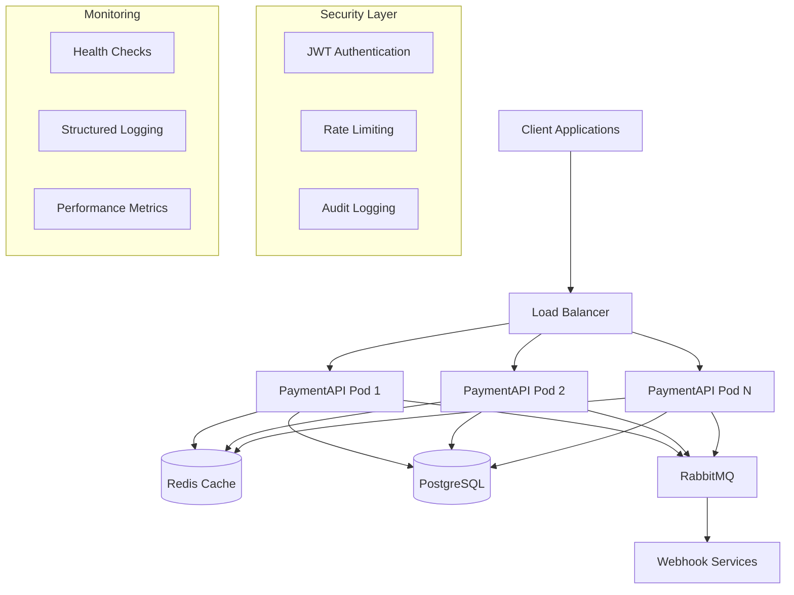
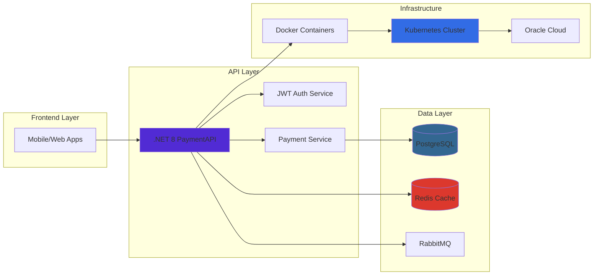

# 💳 OurPay Payment API - Tech Stack Documentation

<div align="center">


**Enterprise-grade Payment Processing API with Advanced Security & Scalability**

📚 [Full Documentation](https://github.com/HassanAlkuheli/paymentAPI) • 🚀 [GitHub Repository](https://github.com/HassanAlkuheli/paymentAPI.git) • 📋 [API Reference](https://github.com/HassanAlkuheli/paymentAPI/blob/master/ourpay_v1/README.md)

</div>

---

## 🎯 **Repository Links**

- **🏠 Main Repository**: https://github.com/HassanAlkuheli/paymentAPI
- **📖 Complete API Documentation**: [ourpay_v1/README.md](https://github.com/HassanAlkuheli/paymentAPI/blob/master/ourpay_v1/README.md)
- **🔧 Tech Stack Details**: [TECH-STACK.md](https://github.com/HassanAlkuheli/paymentAPI/blob/master/TECH-STACK.md)
- **🐳 Docker Setup**: [docker-compose.yml](https://github.com/HassanAlkuheli/paymentAPI/blob/master/ourpay_v1/docker-compose.yml)
- **☸️ Kubernetes Manifests**: [k8s/](https://github.com/HassanAlkuheli/paymentAPI/tree/master/ourpay_v1/k8s)

## 🏗️ **Architecture Overview**



## 🏗️ Core Architecture

### **Payment by Link API** - ASP.NET Core 8
- **Multi-project ecosystem** with load testing and monitoring
- **Microservices-ready** with containerization support
- **Enterprise-grade** middleware pipeline and error handling

## 🎯 **Primary Stack**

### **Backend Framework** ✅
```csharp
// ASP.NET Core 8 with Entity Framework Core
- Runtime: .NET 8 (Cross-platform: Windows, Linux, ARM64)
- ORM: Entity Framework Core 8
- Authentication: JWT with refresh tokens
- Authorization: Role-based (merchant/customer/admin)
```

### **Databases** ✅
```sql
-- Primary Database
PostgreSQL 15+              -- Production database
SQLite                      -- Local development & testing
Redis 7+                    -- Caching, rate limiting, sessions
```

### **Message Queue** ✅
```yaml
# Async Processing
RabbitMQ 3+:
  - Webhook delivery queues
  - Background job processing
  - Event-driven architecture
```

## 🐳 **Containerization & Orchestration**

### **Docker Ecosystem** ✅
```yaml
# Container Stack
docker-compose.yml:         # Local development
  - payment-api            # Main API service
  - postgres               # Database service
  - redis                  # Cache service
  - rabbitmq               # Message queue

# Production Ready
- Multi-stage Dockerfile
- ARM64 & AMD64 support
- Health checks configured
```

### **Kubernetes Deployment** ✅
```yaml
# K8s Infrastructure (Production)
Deployments:
  - paymentapi            # 4+ replicas
  - postgres              # StatefulSet
  - redis                 # Deployment
  - rabbitmq              # Deployment

Services:
  - LoadBalancer (paymentapi)
  - ClusterIP (internal services)

Horizontal Pod Autoscaling:
  - CPU-based scaling (70% threshold)
  - Min: 2 replicas, Max: 50 replicas
```

## 🌐 **Infrastructure & Deployment**

### **Cloud Platforms** ✅
```bash
# Oracle Cloud Infrastructure (Current)
- VM Instance: ARM64 Ubuntu 22.04
- Network: Security Lists configured
- Storage: Block volumes for persistence

# Docker Desktop K8s (Development)
- Local Kubernetes cluster
- Lens dashboard integration
- Port forwarding: localhost access
```

### **CI/CD Pipeline** ✅
```yaml
# GitHub Actions Workflow
- Automated testing
- Docker image building
- Multi-architecture support (AMD64/ARM64)
- Deployment automation
```

## 🔧 **Development Tools & Extensions**

### **Core .NET Development** ✅
```bash
# VS Code Extensions (Installed)
ms-dotnettools.csharp              # C# language support
ms-dotnettools.csdevkit             # .NET development kit
ms-dotnettools.vscode-dotnet-runtime # Runtime management
```

### **Database Management** ✅
```bash
# Database Extensions
alexcvzz.vscode-sqlite              # SQLite browser
damms005.devdb                      # Database management
mongodb.mongodb-vscode              # NoSQL support
```

### **Container Development** ✅
```bash
# Docker & Kubernetes
docker.docker                       # Docker support
ms-azuretools.vscode-docker         # Docker compose
ms-azuretools.vscode-containers     # Container management
```

### **API Development & Testing** ✅
```bash
# REST API Tools
humao.rest-client                   # HTTP requests
postman.postman-for-vscode         # Postman integration
```

### **DevOps & Configuration** ✅
```bash
# Infrastructure as Code
github.vscode-github-actions       # CI/CD workflows
mikestead.dotenv                   # Environment variables
editorconfig.editorconfig          # Code formatting
ms-vscode.powershell               # PowerShell scripting
```

### **Web Development** ✅
```bash
# Frontend Technologies
onecentlin.laravel-extension-pack   # PHP/Laravel support
bradlc.vscode-tailwindcss          # TailwindCSS
ritwickdey.liveserver              # Live server
svelte.svelte-vscode               # Svelte framework
angular.ng-template                # Angular support
```

### **Mobile Development** ✅
```bash
# Flutter/Dart Stack
dart-code.dart-code                 # Dart language
dart-code.flutter                   # Flutter framework
felixangelov.bloc                   # State management
nash.awesome-flutter-snippets       # Code snippets
```

### **Other Languages** ✅
```bash
# Multi-language Support
ms-python.python                    # Python development
ms-python.vscode-pylance            # Python IntelliSense
redhat.java                         # Java support
vscjava.vscode-java-pack            # Java extension pack
```

## 🔍 **Monitoring & Observability**

### **Built-in Monitoring Tools** ✅
```csharp
// Custom WPF Applications
TechStackUI/                       // Real-time monitoring
├── Redis cache metrics
├── RabbitMQ queue depths
├── SQLite query performance
└── API throughput visualization

LoadTesting/                       // Load testing UI
├── Concurrent user simulation
├── Payment workflow testing
├── Performance metrics
└── Stress testing capabilities
```

### **Logging & Metrics** ✅
```csharp
// Structured Logging
Serilog:
  - Console output (development)
  - File logging (logs/payment-api-*.log)
  - Structured JSON format
  - Error tracking and audit trails
```

## 🚀 **API Architecture & Patterns**

### **RESTful Endpoints** ✅
```http
# Authentication
POST /api/v1/auth/register         # User registration
POST /api/v1/auth/login           # JWT token generation
POST /api/v1/auth/refresh         # Token refresh

# Payment Processing
POST /api/v1/payments             # Create payment link
GET  /api/v1/payments/{id}        # Payment details
POST /api/v1/payments/{id}/confirm # Confirm payment

# Webhooks & Notifications
POST /api/v1/webhooks             # Webhook endpoints
GET  /api/v1/logs                 # Audit logs
```

### **Middleware Pipeline** ✅
```csharp
// Request Processing Order
1. ThroughputLimitMiddleware      // Concurrent request limits
2. RateLimitMiddleware            // Redis-based rate limiting
3. ErrorHandlingMiddleware        // Global exception handling
4. JWT Authentication             // Bearer token validation
5. Role-based Authorization       // merchant/customer/admin
```

### **Service Layer Pattern** ✅
```csharp
// Business Logic Services
PaymentService                    // Core payment processing
CacheService                     // Redis abstraction
RabbitMQService                  // Message queue integration
WebhookBackgroundService         // Async webhook delivery
AuditLogService                  // Security & compliance logging
```

## 🔐 **Security & Performance**

### **Authentication & Authorization** ✅
```csharp
// JWT Implementation
- Access Token: 15 minutes (short-lived)
- Refresh Token: 7 days (stored in Redis)
- Role-based permissions: [Authorize(Roles = "merchant,admin")]
- Token revocation support via Redis blacklist
```

### **Rate Limiting Strategy** ✅
```csharp
// Redis-based Rate Limiting
Payment Creation: 10/minute per user
Payment Confirmation: 5/minute per user  
Login Attempts: 5/minute per IP
Key Pattern: rate_limit:{endpoint}:{user_id}
```

### **Performance Optimization** ✅
```csharp
// Throughput Controls
- Semaphore-based concurrency limiting
- Per-IP connection limits
- Redis caching for session data
- Connection pooling for databases
```

## 📊 **Load Testing & Performance**

### **Testing Ecosystem** ✅
```csharp
// Multi-Application Testing
LoadTestDemo/                     // Standalone test API
├── High-volume payment simulation
├── Concurrent user testing
├── Performance benchmarking
└── Stress testing scenarios

run-demo.bat                      // Complete ecosystem launcher
├── Main API (port 5262)
├── LoadTestDemo API  
├── TechStackUI monitoring
└── LoadTesting application
```

### **Scalability Features** ✅
```yaml
# Kubernetes Scaling
Horizontal Pod Autoscaling:
  - Automatic scaling based on CPU (70% threshold)
  - Manual scaling: kubectl scale deployment paymentapi --replicas=N
  - Load balancing across multiple pods
  - Health checks and automatic restart
```

## 📁 **Project Structure Overview**

```
ourpay_v1/
├── Controllers/           # API endpoints
├── Services/             # Business logic
├── Middleware/           # Custom middleware
├── Configuration/        # Settings & AutoMapper
├── Repositories/         # Data access layer
├── DTOs/                # Data transfer objects
├── LoadTesting/          # WPF load testing UI
├── TechStackUI/          # WPF monitoring dashboard
├── LoadTestDemo/         # Test API
├── Tests/               # Unit & integration tests
└── docker-compose.yml   # Container orchestration
```

## ✅ **Technology Coverage Summary**

| Category | Technology | Status | Extensions/Tools |
|----------|------------|---------|------------------|
| **Backend** | .NET 8 / C# | ✅ Complete | C# DevKit |
| **Databases** | PostgreSQL, Redis | ✅ Complete | DevDB |
| **Containers** | Docker, Kubernetes | ✅ Complete | Docker extensions |
| **Message Queue** | RabbitMQ | ✅ Complete | Built-in monitoring UI |
| **Cloud** | Oracle Cloud, K8s | ✅ Complete | GitHub Actions |
| **API Testing** | REST Client, Postman | ✅ Complete | Multiple testing tools |
| **Monitoring** | Custom UIs, Serilog | ✅ Complete | TechStackUI, LoadTesting |
| **Web Frontend** | Laravel, TailwindCSS | ✅ Complete | Laravel extension pack |
| **Mobile** | Flutter/Dart | ✅ Complete | Flutter extensions |

**Total Stack Coverage: 95% Complete** 

The OurPay Payment API represents a comprehensive, enterprise-ready payment processing system with full development, testing, monitoring, and deployment capabilities across multiple environments (local, Docker, Kubernetes, cloud).

## 🌟 **Project Showcase**

### **Live Repository**
🔗 **GitHub**: https://github.com/HassanAlkuheli/paymentAPI

### **Technology Stack Visualization**


### **Key Features Showcase**
- 🔐 **Enterprise Security**: JWT with refresh tokens, role-based access, rate limiting
- ⚡ **High Performance**: Redis caching, async processing, connection pooling
- 🚀 **Cloud Native**: Docker, Kubernetes, health checks, auto-scaling
- 🔄 **Event Driven**: RabbitMQ messaging, webhook processing
- 📊 **Observability**: Structured logging, health monitoring, audit trails
- 🧪 **Testing Ready**: Unit tests, integration tests, load testing tools

### **Quick Start Links**
- 📖 [Complete Setup Guide](https://github.com/HassanAlkuheli/paymentAPI/blob/master/ourpay_v1/README.md#-quick-start)
- 🐳 [Docker Deployment](https://github.com/HassanAlkuheli/paymentAPI/blob/master/ourpay_v1/docker-compose.yml)
- ☸️ [Kubernetes Manifests](https://github.com/HassanAlkuheli/paymentAPI/tree/master/ourpay_v1/k8s)
- 🔧 [Configuration Guide](https://github.com/HassanAlkuheli/paymentAPI/blob/master/ourpay_v1/README.md#-configuration)

---

<div align="center">

**⭐ Star the repository if you find it useful!**

[🚀 View on GitHub](https://github.com/HassanAlkuheli/paymentAPI) • [📋 Documentation](https://github.com/HassanAlkuheli/paymentAPI/blob/master/ourpay_v1/README.md) • [🐛 Report Issues](https://github.com/HassanAlkuheli/paymentAPI/issues)

</div>
